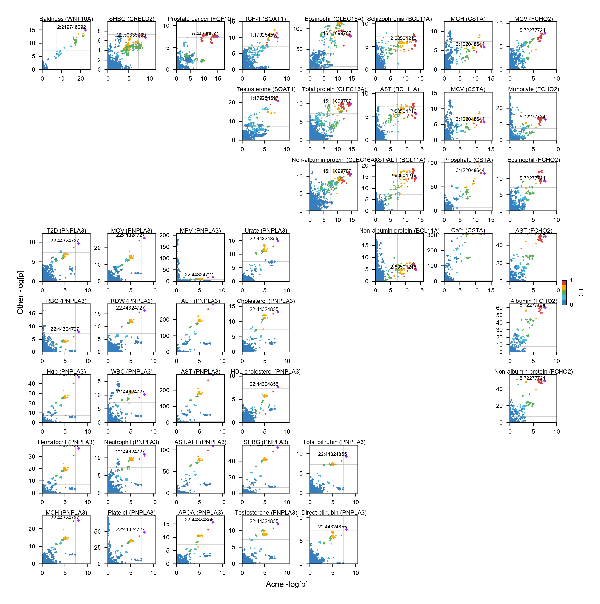

# acne-genetics

 

**Figure 1:** LocuZoom plots of 42 acne GWAS loci. Each locus is named after a gene that is the closest to the most significant SNP (i.e. index SNP) from either 5’ or 3’ end. Shown are ±0.5 Mb windows of corresponding gene start and end sites. Index SNPs are labeled as purple diamond and LD between other SNPs are displayed with the intensity of red color. LD is calculated with individuals of European ancestry in the 1000 Genomes Project reference panel. Gene annotation is based on GENCODE v39 and genomic coordinates are based on the GRCh37 human genome build. Purple line denotes genome-wide significance threshold (*P* = 5e-8), and yellow lines denote gene start and end sites. The 39 non-complicated GWAS loci are visualized in the order of the strength of their association from top to bottom and left to right. For example, the most significant GWAS signal for acne resides within the 15q26 region with multiple independent signals within the *SEMA4B* gene. The three loci that reside in complex regions of the human genome with extended LD (i.e. 5q31, 8p23, and MHC) are also shown in the bottom right corner.

 

**Figure 2:** Colocalization of acne GWAS signals in 9 loci. Shown is the strength of association as -log10*P* for acne and other relevant GWAS results. Index SNPs for acne GWAS are labeled as purple diamond and LD between other SNPs are displayed. LD is calculated with individuals of European ancestry in the 1000 Genomes Project reference panel. Genomic coordinates are based on the GRCh37 human genome build. Gray line denotes genome-wide significance threshold (P = 5e-8). Baldness (male-pattern baldness), Eosinophil (eosinophil count), MCH (mean corpuscular hemoglobin), MCV (mean corpuscular volume), Monocyte (monocyte count), MPV (mean platelet volume), Neutrophil (neutrophil count), RBC (RBC count), RDW (red cell distribution width), SHBG (sex hormone binding globulin), T2D (type II diabetes), WBC (WBC count).
